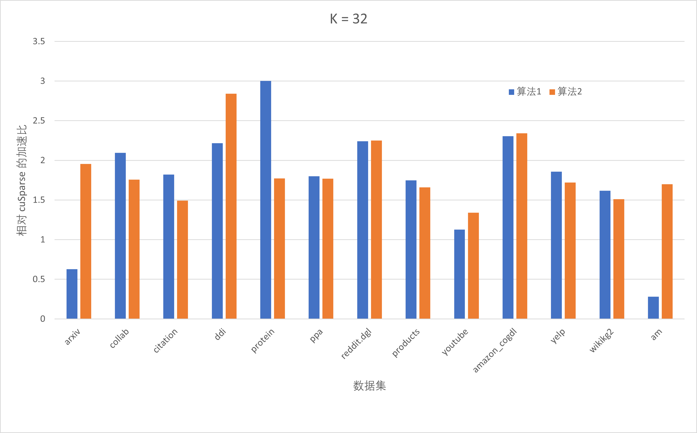

# 实验三：稀疏矩阵-矩阵乘 实验报告

张天乐 2018011038

### 实现方法

#### warp divergence

reference 实现中同一个 warp 内部的线程工作量差距很大。因此改变并行维度，一个 warp 只对应矩阵 A 一行的计算，将 B 的不同列分配给不同线程，使得同一个 warp 内线程处理相同的工作量。

#### shared memory

一个 warp 对应稀疏矩阵 A 的一行，A 的数据会被 warp 内的线程反复读取。因此，将稀疏矩阵的数据加载到共享内存。

#### load imbalance

稀疏矩阵不规则，不同行的非零元差异很大，极端情况下 20% 的行包含了 80% 的元素（甚至更多）。因此对稀疏矩阵预处理，将行进一步划分，以一定的 TaskSize 将行分为多个 Task 。将 Task 分配给 warp ，而不是一整行。

### 不同优化对性能的影响

下图中显示了不同的实现在不同数据集上相对 cuSparse 的加速比（K=32）：算法1实现了前两步，消除了 warp divergence 的问题，利用了共享内存；算法2实现了前三步，进行预处理，解决稀疏矩阵不规则的问题。

### 相对于 cuSparse 的加速比

#### `kLen = 32`

| Dataset      | cuSparse  | opt      | 加速比         |
| ------------ | --------- | -------- | ----------- |
| arxiv        | 770.46    | 385.70   | 2.001063002 |
| collab       | 1333.05   | 636.38   | 2.097677488 |
| citation     | 16457.93  | 9054.93  | 1.816319949 |
| ddi          | 640.03    | 224.75   | 2.845784205 |
| protein      | 24576.89  | 8207.20  | 2.998373379 |
| ppa          | 18396.50  | 10222.89 | 1.799407995 |
| reddit.dgl   | 48312.52  | 21133.59 | 2.286316712 |
| products     | 55847.75  | 31927.21 | 1.749283448 |
| youtube      | 3641.76   | 2712.84  | 1.342139603 |
| amazon_cogdl | 123925.86 | 52310.59 | 2.369120287 |
| yelp         | 6577.50   | 3538.74  | 1.858706771 |
| wikikg2      | 7138.12   | 4419.95  | 1.61683277  |
| am           | 3736.00   | 2195.25  | 1.702990548 |

#### `kLen = 256`

| Dataset      | cuSparse | opt      | 加速比        |
| ------------ | -------- | -------- | ---------- |
| arxiv        | 2996.17  | 2741.4   | 1.092926   |
| collab       | 5201.75  | 4319     | 1.204399   |
| citation     | 78962.6  | 68957    | 1.145092   |
| ddi          | 1544.26  | 1516.2   | 1.018534   |
| protein      | 80433.4  | 68273    | 1.17811    |
| ppa          | 84973.4  | 81022    | 1.048773   |
| reddit.dgl   | 202117   | 174163   | 1.160506   |
| products     | 258494   | 247944   | 1.042552   |
| youtube      | 14442.9  | 14320    | 1.008611   |
| amazon_cogdl | 515644   | 426497   | 1.209021   |
| yelp         | 30001.1  | 26608    | 1.127511   |
| wikikg2      | 16773.9  | 20101    | 0.834497   |
| am           | 13404.1  | 13778.25 | 0.97284706 |
