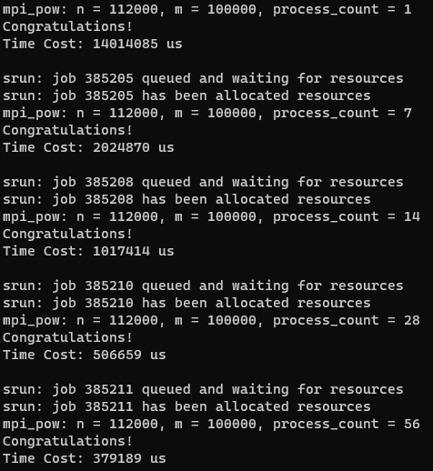

# 小作业零：pow_a

#### 1. 函数 `pow_a` 的源代码

```cpp
// openmp_pow.cpp
void pow_a(int *a, int *b, int n, int m) {
    #pragma omp parallel for
    for (int tid = 0; tid < omp_get_num_threads(); ++tid){
        int scale = n / omp_get_num_threads();
        int start_i = omp_get_thread_num() * scale;
        for (int i = start_i; i < start_i + scale; i++) {
            int x = 1;
            for (int j = 0; j < m; j++)
                x *= a[i];
            b[i] = x;
        }
    }
}
```

```cpp
// mpi_pow.cpp
void pow_a(int *a, int *b, int n, int m, int comm_sz /* 总进程数 */) {
    for (int i = 0; i < n / comm_sz; i++) {
        int x = 1;
        for (int j = 0; j < m; j++)
            x *= a[i];
        b[i] = x;
    }
}
```

#### 2.  openmp 版本的运行时间及加速比


| 线程      | 1        | 7           | 14         | 28          |
| ------- | -------- | ----------- | ---------- | ----------- |
| 时间 / us | 14025204 | 2017058     | 1010679    | 517003      |
| 加速比     |          | 6.953297327 | 13.8770114 | 27.12789674 |

#### 3. MPI 版本的运行时间及加速比



| 线程  | 1×1      | 1×7         | 1×14        | 1×28        | 2×28        |
| --- | -------- | ----------- | ----------- | ----------- | ----------- |
| 时间  | 14014085 | 2024870     | 1017414     | 506659      | 379189      |
| 加速比 |          | 6.920980112 | 13.77422072 | 27.65979683 | 36.95804731 |
