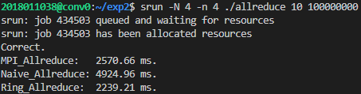

# MPI 异步通信小作业 实验报告

张天乐 2018011038

### Ring Allreduce 算法

```cpp
void Ring_Allreduce(void* sendbuf, void* recvbuf, int n, MPI_Comm comm, int comm_sz, int my_rank)
{
    memcpy(recvbuf, sendbuf, n * sizeof(float));
    int block_size = n / comm_sz;
    float* recv_data = new float[block_size];
    float* databuf = (float*)recvbuf;
    MPI_Request request[2];

    // 第一阶段 comm_sz - 1 步
    for (int k = 0; k < comm_sz - 1; k++)
    {
        int offset_send = ((my_rank - k + comm_sz) % comm_sz) * block_size;
        int offset_recv = ((my_rank - k - 1 + comm_sz) % comm_sz) * block_size;
        // 发送数据块
        MPI_Isend(databuf + offset_send, block_size, MPI_FLOAT, (my_rank + 1 + comm_sz) % comm_sz, k, MPI_COMM_WORLD, &request[0]);
        MPI_Irecv(recv_data, block_size, MPI_FLOAT, (my_rank - 1 + comm_sz) % comm_sz, k, MPI_COMM_WORLD, &request[1]);
        MPI_Wait(&request[1], nullptr);
        // 将收到的数据与自身相加
        for (int i = 0; i < block_size; i++)
        {
            databuf[offset_recv + i] += recv_data[i];
        }
        MPI_Wait(&request[0], nullptr);
    }

    // 第二阶段 comm_sz - 1 步
    for (int k = 0; k < comm_sz - 1; k++){
        int offset_send = ((my_rank + 1 - k + comm_sz) % comm_sz) * block_size;
        int offset_recv = ((my_rank - k + comm_sz) % comm_sz) * block_size;
        // 发送数据块
        MPI_Isend(databuf + offset_send, block_size, MPI_FLOAT, (my_rank + 1 + comm_sz) % comm_sz, k, MPI_COMM_WORLD, &request[0]);
        MPI_Irecv(databuf + offset_recv, block_size, MPI_FLOAT, (my_rank - 1 + comm_sz) % comm_sz, k, MPI_COMM_WORLD, &request[1]);
        MPI_Wait(&request[1], nullptr);
        MPI_Wait(&request[0], nullptr);
    }
}
```

1. 首先将进程的数据分为 comm_sz 个数据块。

2. 第一阶段共 (comm_sz - 1) 步。在第 k 步，进程将第 (my_rank - k) % comm_sz 数据块发送给 my_rank + 1 进程。同时将收到的数据块加到第 (my_rank - k - 1) % comm_sz 数据块。

3. 第二阶段共 (comm_sz - 1) 步。在第 k 步，进程将第 (my_rank + 1 - k) % comm_sz 数据块发送给 my_rank + 1 进程。同时将收到的数据块保存到第 (my_rank - k) % comm_sz 数据块。

### 时间测试

测试 4×1 进程下 10 轮通信量为 100000000 的程序运行时间。



进行更多测试。

| 进程数 | 轮数  | 通信量       | MPI_Allreduce | Naive_Allreduce | Ring_Allreduce |
| --- | --- | --------- | ------------- | --------------- | -------------- |
| 1×4 | 10  | 100000000 | 3100.29 ms    | 5630.46 ms      | 3001.14 ms     |
| 4×1 | 10  | 100000000 | 2570.66 ms    | 4924.96 ms      | 2239.21 ms     |
| 4×2 | 10  | 100000000 | 3099.35 ms    | 6490.68 ms      | 2985.72 ms     |
| 4×4 | 10  | 100000000 | 4286.98 ms    | 7792.57 ms      | 3584.36 ms     |
| 4×2 | 10  | 10000000  | 341.864 ms    | 657.754 ms      | 282.057 ms     |
| 4×2 | 10  | 1000000   | 35.3872 ms    | 52.9092 ms      | 31.3317 ms     |

实现的 Ring Allreduce 算法比 MPI_Allreduce 快
